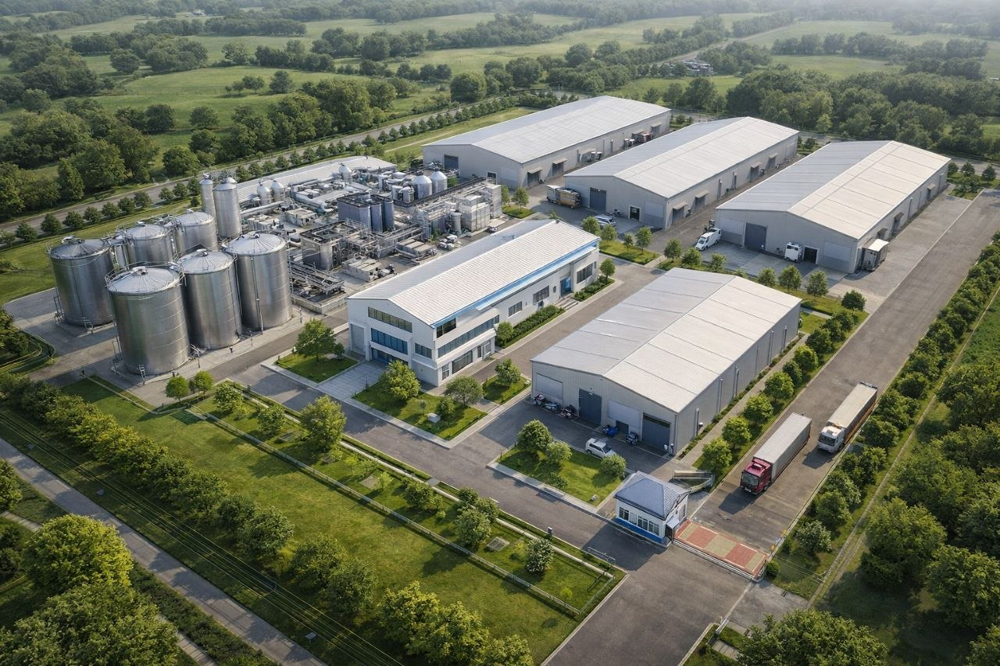
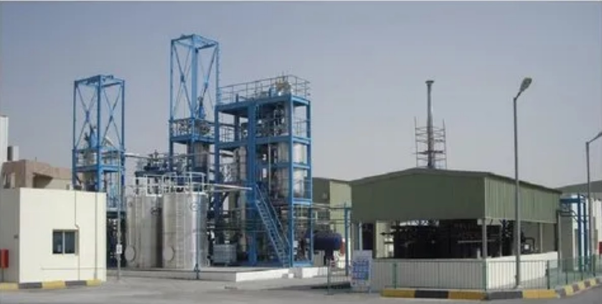
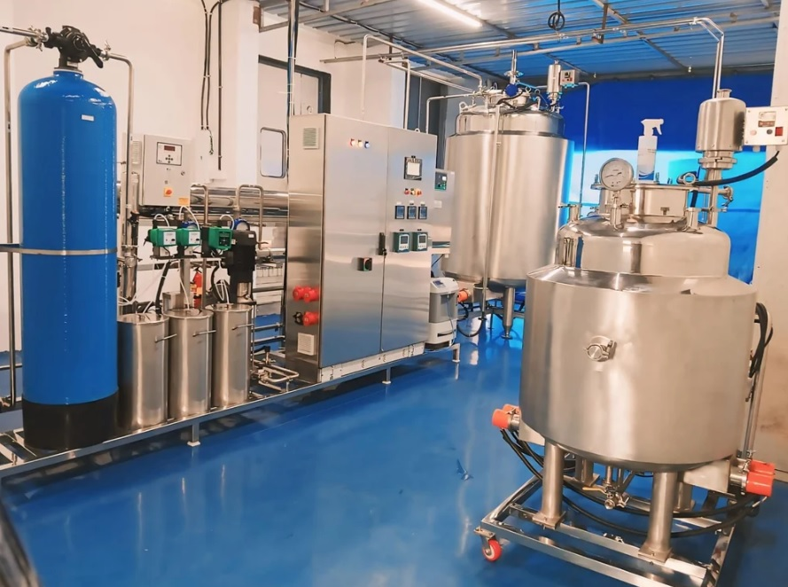
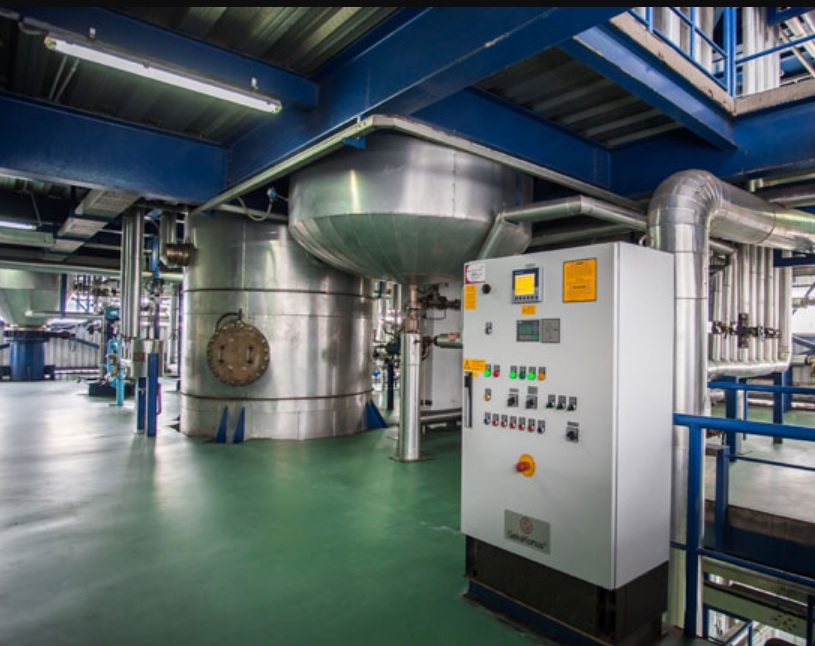
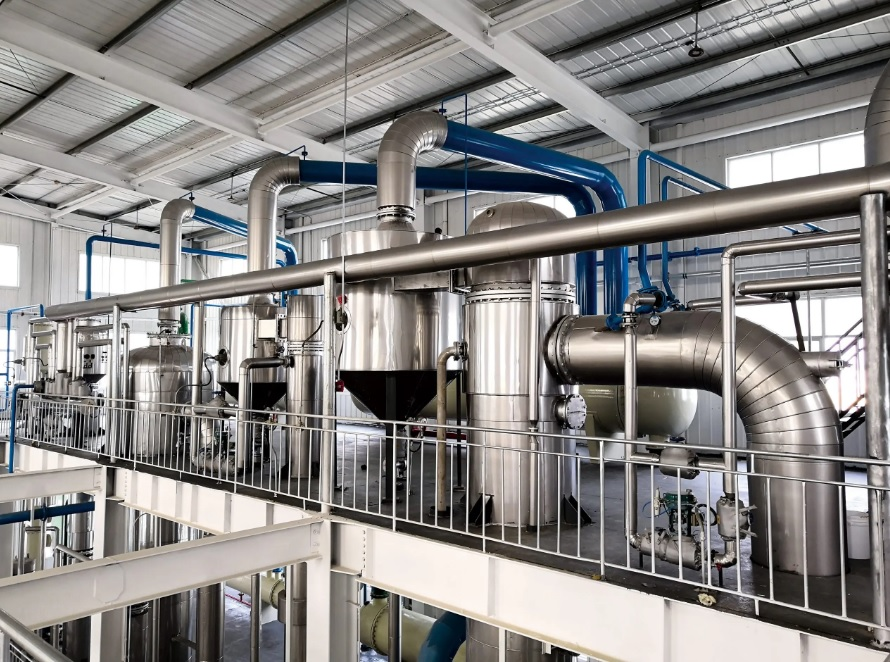
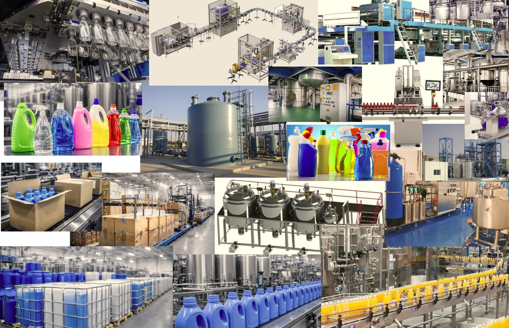

# Downstream Chemical & Detergent Production Project

## Quick Overview

A scalable industrial detergent production platform designed to leverage petrochemical proximity, optimize supply chain efficiency, and deliver export-driven growth in high-demand regional markets.

---

## Project Structure

- [Project Concept](01-project-concept.md)
- [Technical Design](02-technical-design.md)
- [Operations Plan](03-operations-plan.md)
- [Market Analysis](04-market-analysis.md)
- [Financial Model](05-financial-model.md)
- [Environmental Impact](06-environmental-impact.md)
- [Risk Analysis](07-risk-analysis.md)
- [Implementation Roadmap](08-implementation-roadmap.md)
- [Team](09-team.md)
- [Partners](10-partners.md)

---

## Executive Summary

This project presents a scalable industrial model for detergent and cleaning product manufacturing, designed to combine cost efficiency, strategic location advantage, and export-driven revenue generation.

By locating the facility near petrochemical and refinery infrastructure, the project achieves:

- Lower raw material cost  
- Reduced logistics expenses  
- Higher operational efficiency  

At the same time, access to export routes enables rapid distribution to high-demand markets.

### Investment Profile

- Investment: 3M – 6M USD  
- Revenue Potential: 9M – 28M USD annually  
- Profit Margin: 20% – 35%  
- ROI: 1.5 – 3 years  

👉 The project is structured as a scalable industrial platform, not a single production unit.

---

## Strategic Positioning

This is not just a small factory.

It is a location-driven industrial strategy integrating:

- Petrochemical supply chains  
- Efficient manufacturing systems  
- Export-oriented logistics  
- Scalable production capacity  

---

## Industrial Structure

The facility includes:

- Raw material storage  
- Processing and reaction systems  
- Industrial mixing units  
- Automated control systems  
- Filling and packaging lines  
- Finished goods warehouse  
- Export logistics and loading zone  

👉 Designed for continuous production and high efficiency.

---

## Production Workflow

Raw Materials → Processing → Mixing → Packaging → Storage → Export

---

## Product Portfolio

- Dishwashing liquid  
- Hand wash  
- Bleach  
- Descaler  
- Glass cleaner  
- Disinfectants  

👉 Product mix can be adapted based on market demand.

---

## Location Strategy

### Petrochemical Proximity

- Lower raw material cost  
- Supply chain stability  
- Reduced transportation cost  

### Export Access

- Faster delivery  
- Competitive pricing  
- Market scalability  

---

## Market Opportunity

Target regions:

- Iraq  
- UAE  
- Saudi Arabia  
- Kuwait  
- Bahrain  
- Afghanistan  
- Pakistan  

👉 These markets offer:

- High consumption  
- Import dependency  
- Stable demand  

---

## Financial Logic

### Cost Advantages

- Low production cost  
- Reduced logistics expenses  
- Efficient manufacturing  

### Revenue Streams

- Export contracts  
- Bulk supply  
- Wholesale distribution  
- Private label production  

### Value Creation

- Industrial value addition  
- Export revenue generation  
- Foreign currency inflow  
- Job creation  

---

## Visual Overview

### Facility Layout

### Production Site

### Pipeline Infrastructure

### Mixing Unit

### Control System

### Reaction Line

### Production Workflow

### Product Sample

---

## Investment Opportunity

We are open to collaboration with:

- Strategic investors  
- Industrial partners  
- Export-focused companies  

---

## Strategic Vision

To build a scalable industrial production platform that combines:

- Cost efficiency  
- Export capability  
- Industrial scalability  
- Strong financial performance  

---

## Conclusion

This project represents a high-potential industrial investment opportunity combining:

- Strategic location advantage  
- Industrial efficiency  
- Strong financial fundamentals  
- Export-driven scalability  

👉 Positioned for long-term profitability and regional market expansion.
