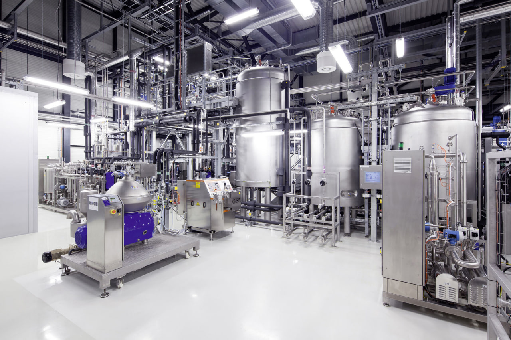
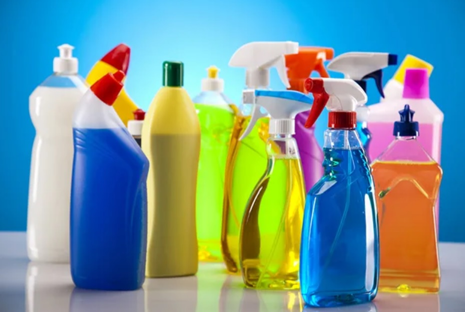

# Downstream Chemical & Detergent Production Project

## Industrial Development Opportunity – Southern Iran Focus

---

## Overview

This project presents a scalable and investment-ready concept for establishing a detergent and cleaning product manufacturing facility in strategically selected regions of southern and southwestern Iran.

The core concept is based on two critical industrial and economic factors:

- Proximity to petrochemical and refinery complexes
- Direct access to export routes (sea and land borders)

This combination enables cost-efficient production, reduced logistics expenses, and strong export potential to regional markets.

---

## Strategic Location Advantage

Southern and southwestern Iran offer a unique industrial advantage due to:

- Access to major petrochemical and refinery hubs  
- Direct proximity to Persian Gulf export routes  
- Established trade corridors with neighboring countries  

### Target Export Markets:
- Iraq  
- Kuwait  
- Saudi Arabia  
- United Arab Emirates  
- Bahrain  
- Afghanistan  
- Pakistan  
- Syria  

These markets demonstrate strong and continuous demand for cleaning and detergent products.

---

## Industrial Concept

The project focuses on the production of a wide range of cleaning and detergent products, including:

- Dishwashing liquids  
- Handwashing liquids  
- Multi-purpose cleaners  
- Surface disinfectants  
- Glass cleaners  
- Bleaching agents  
- Industrial cleaning solutions  

Production flexibility allows adaptation based on market demand and investor strategy.

---

## Production Workflow

The industrial process is designed as a continuous and optimized production system:

Raw Materials → Processing → Mixing → Quality Control → Packaging → Distribution → Export

---

## Facility Overview

### Production Infrastructure

.jpg)

### Petrochemical Proximity

.jpg)

### Processing & Pipeline Systems

### Mixing & Processing Units

### Process Control Systems

### Production Line

### Workflow Overview

### Product Reference

---

## Operational Experience

Over the years, I have gained hands-on experience across multiple industrial sectors, including:

- Construction and infrastructure projects (roads, pipelines, industrial sites)  
- Chemical and detergent manufacturing  
- Industrial systems related to sugarcane processing and ethanol production  
- Stone and mineral processing industries  
- Warehouse management and production supervision  
- Financial accounting and cost control  

This experience provides a practical, end-to-end understanding of industrial systems — from raw material handling to production, logistics, and final delivery.

---

## Investment Value

This project offers:

- Low transportation costs due to strategic location  
- High production efficiency through industrial integration  
- Strong export potential in regional markets  
- Scalable production capacity  
- High demand products with continuous market need  

---

## Vision

To develop practical, scalable, and high-efficiency industrial projects that bridge real operational experience with structured industrial planning.

---

## Collaboration

Open to collaboration with:

- Investors  
- Industrial partners  
- Manufacturing companies  
- Export-focused businesses  

---

## Project Portfolio

🔗 Explore more projects:  
https://lnkd.in/ewBTbmYu
